<div align="center">

# 🍵 TeaBuddy
### *Your Personal Chai Companion*
#### https://teabuddy.streamlit.app/ 

[](https://streamlit.io/)
[](https://www.python.org/downloads/)
[](https://opensource.org/licenses/MIT)

*A multilingual web application that crafts personalized chai recipes based on your mood and health, featuring interactive step-by-step cooking guidance.*

---

</div>

## 🌟 **What Makes TeaBuddy Special?**

<table>
<tr>
<td width="50%">

### 🌍 **Global Tea Culture**
- **3 Languages**: English, हिंदी, বাংলা
- **Cultural Authenticity**: Traditional recipes
- **Instant Translation**: Switch languages seamlessly

</td>
<td width="50%">

### 🧠 **Smart Recommendations**
- **Mood-Based**: Happy, Sad, Tired, Stressed, Creative
- **Health-Conscious**: Cold/Flu, Upset Stomach, Low Energy
- **AI-Powered**: Intelligent recipe matching

</td>
</tr>
<tr>
<td width="50%">

### 👨‍🍳 **Interactive Cooking**
- **Step-by-Step**: Visual progress tracking
- **Real-Time Timers**: Never overcook again
- **Heat Indicators**: Perfect temperature control

</td>
<td width="50%">

### 🎉 **Delightful Experience**
- **Celebration Effects**: Balloon animations
- **Mobile Responsive**: Cook anywhere
- **Modern UI**: Clean, intuitive design

</td>
</tr>
</table>

---

## 🚀 **Quick Start Guide**

<div align="center">

### *Get your perfect chai in 3 simple steps!*

</div>

```bash
# 1️⃣ Install Streamlit
pip install streamlit

# 2️⃣ Run TeaBuddy
streamlit run app.py

# 3️⃣ Open in browser
# 🌐 http://localhost:8501
```

<div align="center">

**🎯 That's it! You're ready to brew! 🎯**

</div>

---

## 📱 **How It Works**

```mermaid
graph LR
    A[🌍 Choose Language] --> B[😊 Select Mood]
    B --> C[🏥 Health Check]
    C --> D[🍵 Get Recipe]
    D --> E[👨‍🍳 Start Cooking]
    E --> F[🎉 Celebrate!]
    
    style A fill:#e1f5fe
    style B fill:#f3e5f5
    style C fill:#e8f5e8
    style D fill:#fff3e0
    style E fill:#fce4ec
    style F fill:#f1f8e9
```

<div align="center">



</div>

---

## 🏗️ **Project Architecture**

<div align="center">

```
🍵 teabuddy-streamlit/
├── 🚀 app.py                      # Main Application
├── 📋 requirements.txt            # Dependencies
├── 📖 README.md                   # You are here!
└── 📁 data/                      # Application Data
    ├── 🗃️ all_chai_recipes.json   # Recipe Database
    ├── 🎯 recommendation_map.json # Smart Mappings
    └── 🌐 lang/                   # Translations
        ├── 🇺🇸 en.json             # English
        ├── 🇮🇳 hi.json             # हिंदी
        └── 🇧🇩 bn.json             # বাংলা
```

</div>

---

## 🎮 **User Journey**

<div align="center">

| Step | Action | Experience |
|------|--------|------------|
| **1** | 🌍 **Language Selection** | Choose your preferred language from sidebar |
| **2** | 😊 **Mood & Health** | Tell us how you're feeling today |
| **3** | 🎯 **Smart Recommendation** | Get your personalized chai recipe |
| **4** | 👨‍🍳 **Interactive Cooking** | Follow step-by-step visual guidance |
| **5** | 📊 **Progress Tracking** | Watch your cooking progress in real-time |
| **6** | 🎉 **Celebration** | Enjoy balloons when you complete your chai! |

</div>

---

## 🛠️ **Customization Made Easy**

<details>
<summary><b>🍵 Adding New Recipes</b></summary>

<br>

Edit `data/all_chai_recipes.json`:

```json
{
  "masala_chai_special": {
    "name": {
      "en": "🌶️ Spicy Masala Chai",
      "hi": "🌶️ तीखी मसाला चाय",
      "bn": "🌶️ ঝাল মসলা চা"
    },
    "description": {
      "en": "A perfect blend of aromatic spices",
      "hi": "सुगंधित मसालों का बेहतरीन मिश्रण",
      "bn": "সুগন্ধি মশলার নিখুঁত মিশ্রণ"
    },
    "ingredients": [
      "💧 Water - 2 cups",
      "🍃 Tea leaves - 2 tsp",
      "🥛 Milk - 1 cup",
      "🫚 Ginger - 1 inch",
      "🧄 Cardamom - 3 pods"
    ],
    "steps": [
      {
        "instruction": {
          "en": "🔥 Boil water with spices",
          "hi": "🔥 मसालों के साथ पानी उबालें",
          "bn": "🔥 মশলা দিয়ে পানি ফোটান"
        },
        "duration": 180,
        "heat": "high"
      }
    ],
    "total_time": 900
  }
}
```

</details>


## 🌟 **Streamlit Superpowers**

<div align="center">

| Feature | Benefit | Impact |
|---------|---------|---------|
| **⚡ Instant Reactivity** | No page refreshes needed | Seamless UX |
| **🎛️ Built-in Widgets** | Native controls | Professional feel |
| **💾 Session State** | Persistent user data | Smooth experience |
| **☁️ Easy Deployment** | One-click to cloud | Global accessibility |
| **📱 Mobile Ready** | Auto-responsive | Cook anywhere |

</div>

## 🐛 **Troubleshooting**

<div align="center">

### *Common Issues & Quick Fixes*

</div>

| Problem | Solution | Command |
|---------|----------|---------|
| **🔒 Port in Use** | Use different port | `streamlit run app.py --server.port 8502` |
| **📁 Files Missing** | Check data directory | Ensure `data/` folder exists |
| **🌐 Language Issues** | Clear cache | Press 'C' in browser, then refresh |
| **🐌 Slow Performance** | Restart server | `Ctrl+C` then `streamlit run app.py` |

---
### 🙏 **Acknowledgments**

**Special Thanks To:**
- 🚀 **Streamlit Team** - For the incredible framework
- 🍵 **Chai Enthusiasts** - For recipe testing and feedback  
- 🌍 **Translation Community** - For multilingual support
- 💻 **Open Source Community** - For inspiration and support

</div>

---

<div align="center">

## 🍵 **Ready to Brew?**

### *Your perfect cup of chai is just one click away!*

```bash
streamlit run app.py
```

**🌟 Happy Brewing! 🌟**

---

*Made with ❤️ by Tuhin*

</div>
